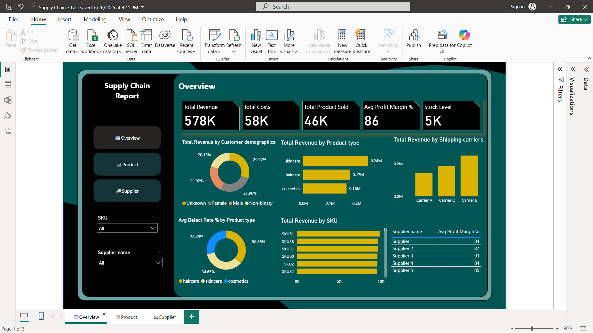
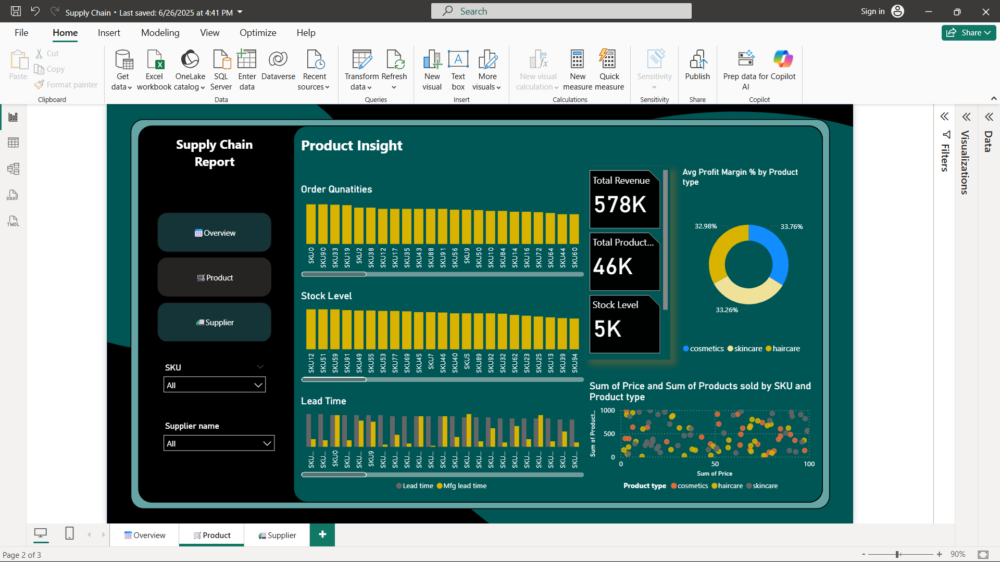
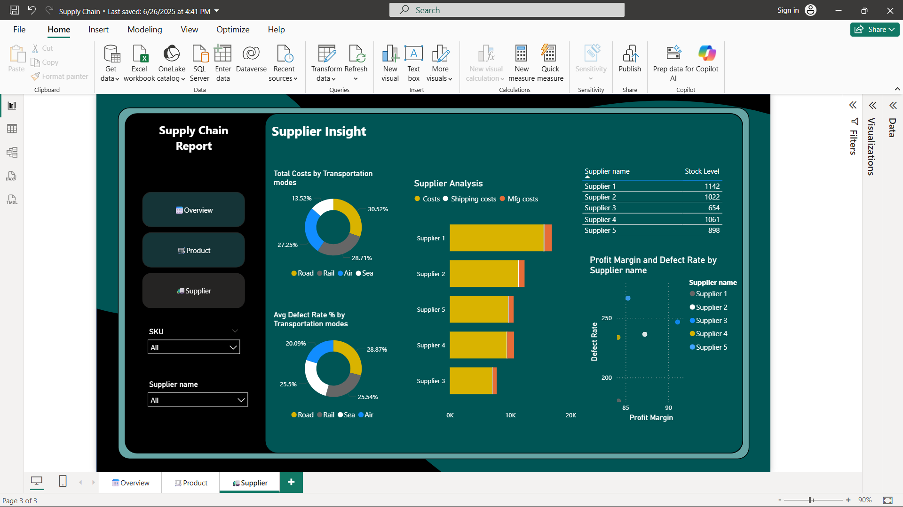

# 📦 Supply Chain Performance Dashboard

## 📖 Project Overview
This project focuses on analyzing supply chain operations using data visualization techniques to monitor key performance indicators (KPIs) such as inventory levels, order fulfillment rates, and delivery performance. The goal is to provide actionable insights that help improve efficiency and decision-making in supply chain management.

---

## 🎯 Objectives
- Track and monitor supply chain KPIs
- Identify bottlenecks in order fulfillment and delivery
- Improve inventory management through data insights
- Enable data-driven decision-making

---

## 🛠️ Tools & Technologies
- Power BI (Dashboard & Visualization)
- MS Excel (Data Cleaning & Preparation)

---

## 📊 Key Features
- Interactive dashboard with slicers and filters
- KPI cards for quick performance overview
- Trend analysis using line and bar charts
- Drill-down capabilities for deeper insights
- User-friendly and dynamic visuals

---

## 📷 Dashboard Preview

### Main Dashboard

### report Analysis

### Supplier View

---

## 🔍 Data Processing Steps
1. Collected raw supply chain dataset  
2. Cleaned and preprocessed data using Excel  
3. Transformed data for analysis  
4. Loaded dataset into Power BI  
5. Created relationships and data model  
6. Designed interactive dashboard  

---

## 📈 Insights & Findings
- Detected delays in order fulfillment process  
- Identified inventory imbalance across categories  
- Highlighted trends affecting delivery performance  
- Improved visibility into operational inefficiencies  

---

## 🚀 How to Use
1. Download the `.pbix` file from this repository  
2. Open using Power BI Desktop  
3. Use filters and slicers to explore insights  

---

## 👩‍💻 Author
**G. Abhi Rami**  
📧 gundrathiabhirami03@gmail.com  
